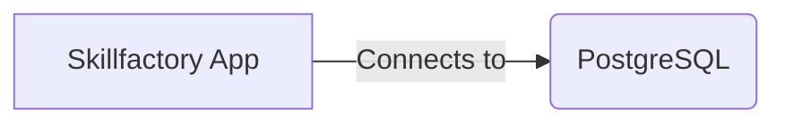

# Skillfactory Diploma Work Web App

This is the README file for the Skillfactory Diploma Work Web App project. The app is designed to serve as the final product of diploma project for the Skillfactory  DevOps course.

## Installation

Follow these steps to install and run the Skillfactory Diploma Work Web App:

1. Clone the repository:

```shell
git clone https://github.com/Morshimus/SkillFactory-Diploma-Work-Web-App.git
```

2. Change to the project directory:

```shell
cd SkillFactory-Diploma-Work-Web-App/Skillfactory
```

3. Create and activate a virtual environment:

```shell
python -m venv __py__;
source __py__/bin/activate
```

4. Install the dependencies:

```shell
pip install -r requirements.txt
```

5. Set up the PostgreSQL database:
   - Create a new PostgreSQL database instance.
   - Mentioned credentials in env for container\helm

6. Set the `Test_ENV` environment variable:
   - In your command prompt, run the following command to set the `Test_ENV` environment variable to `True`:

```shell
export Test_ENV=True
```

7. Apply the database migrations:

```shell
python manage.py migrate
```

8. Run the development server:

```shell
python manage.py runserver
```

The Skillfactory Diploma Work Web App should now be up and running on [http://localhost:8000](http://localhost:8000).

## Architecture

The following Mermaid schema demonstrates the app's connection to a PostgreSQL instance:



## Prometheus Metrics

The Skillfactory Diploma Work Web App includes built-in Prometheus metrics for monitoring purposes. These metrics provide insights into the app's performance, request handling, and resource usage.

You can access the Prometheus metrics by visiting the following endpoint while the app is running:

http://localhost:8000/metrics

The metrics are automatically exposed in a format compatible with Prometheus, making it easy to integrate with Prometheus monitoring systems.

## Contributing

If you'd like to contribute to the Skillfactory Diploma Work Web App, please follow these guidelines:

Fork the repository and create a new branch for your feature or bug fix.
Commit your changes and push them to your forked repository.
Open a pull request with a clear description of your changes.
We appreciate your contributions!

## License

This project is licensed under the MIT License.